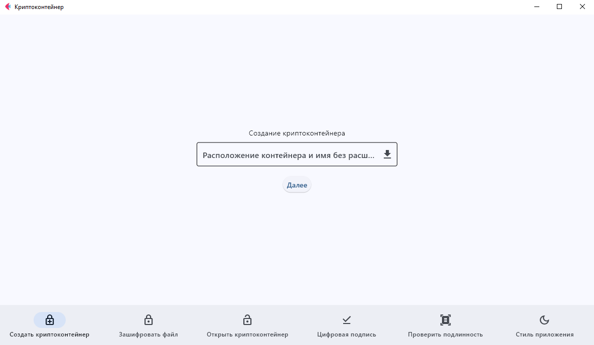
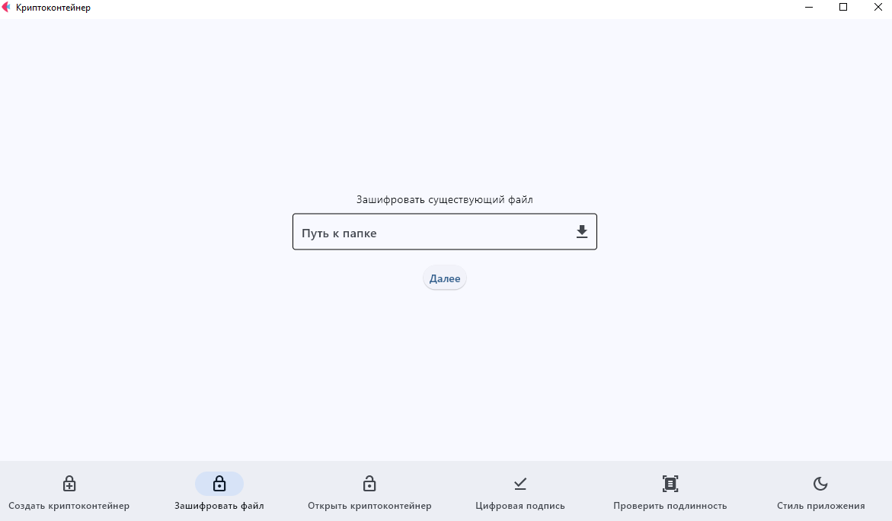
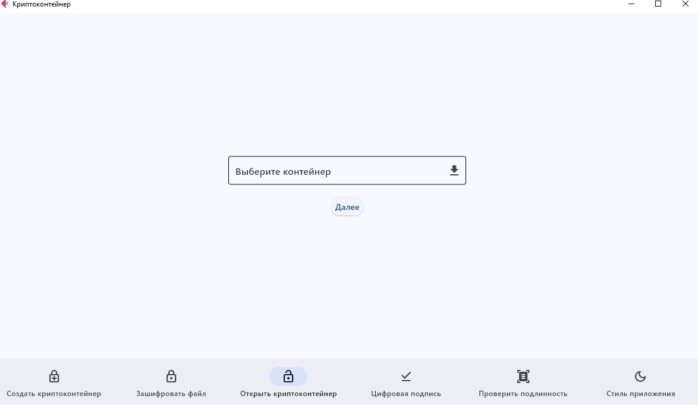
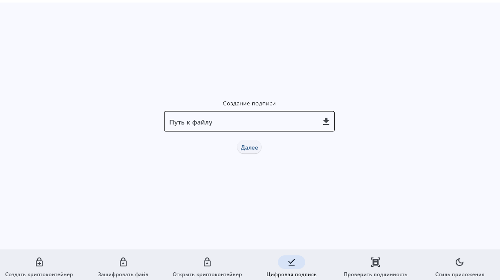
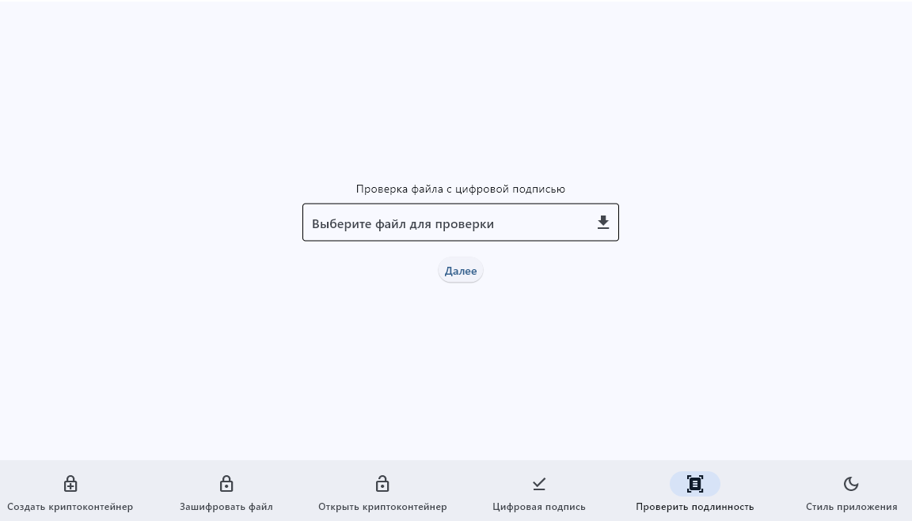
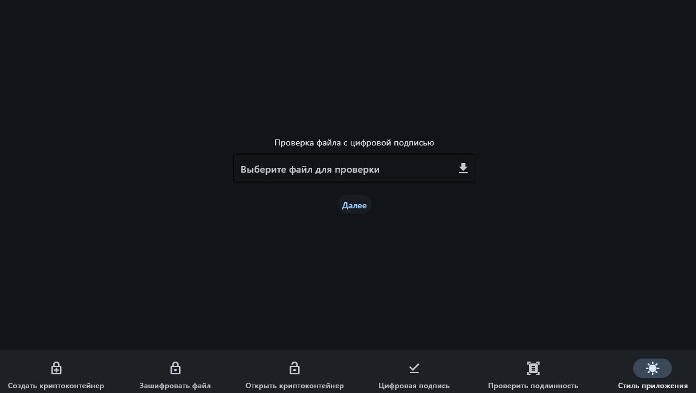

# 🔐 ViCrypt

## 📌 Описание проекта
**ViCrypt** — это Декстопное-приложение для работы с криптоконтейнерами. Оно позволяет создавать зашифрованные контейнеры, подписывать файлы и проверять их подлинность. Приложение использует **Flet** для графического интерфейса.

---

## 🚀 Функциональность
- 🔑 **Создание криптоконтейнера**
- 🔏 **Шифрование уже существующих файлов**
- 🔓 **Открытие зашифрованных файлов**
- 🖋️ **Подписание файлов**
- 🔍 **Проверка подписи на подлинность**

📌 **Важно:** Шифруется именно **папка**, а не отдельные файлы. Полученный зашифрованный контейнер имеет расширение **`.cont`**.

---

## 📂 Скриншоты функционала

### 🔑 Создание криптоконтейнера


### 🔏 Шифрование файлов


### 🔓 Расшифровка файлов


### 🖋️ Подписание файлов


### 🔍 Проверка подписи


### Смена темы приложения


---

## 📂 Структура проекта
```plaintext
CryptoContainer/
│── back/              # Основные криптографические модули
│   ├── AES.py         # AES-шифрование
│   ├── Hash.py        # Хеширование файлов
│   ├── Podpis.py      # Подписание файлов
│   ├── Router.py      # Маршрутизация
│   ├── FoldertoCont.py # Преобразование папок в контейнеры
│── View/              # Графический интерфейс (Flet)
│   ├── main_view.py   # Основной интерфейс приложения
│   ├── main.py        # Точка входа в приложение
│   ├── icon.ico       # Иконка приложения
│── dist/              # Скомпилированные исполняемые файлы
│   ├── ViKrypt.exe    # Новая версия
│   ├── VKript.exe     # Старая версия
│── README.md          # Этот файл

```
---

# 🔧 Установка и запуск
### 1️⃣ Клонирование репозитория
```sh
git clone https://github.com/viyalimo/Crypt.git
cd Crypt
```

### 2️⃣ Установка зависимостей

```sh
pip install flet flet-route cryptography pycryptodome
```

### 3️⃣ Запуск приложения

```sh
python main.py
```
---

# 📌 **Альтернативный вариант:**  
Если вы не хотите запускать исходники, скачайте **ViCrypt.exe** из папки `dist`.  
Файл **Vcript.exe** – это старая версия, используйте **ViCrypt.exe**.

---

## 🛠 Используемые библиотеки
- **Flet** — графический интерфейс
- **PyCryptodome** — реализация криптографических алгоритмов
- **Cryptography** — работа с подписью и ключами
- **PyInstaller** — упаковка в исполняемые файлы

---

## 📞 Контакты
Если у вас есть вопросы или предложения, свяжитесь со мной через GitHub.

🚀 **Развивайте проект и используйте его на здоровье!** 😊

---
